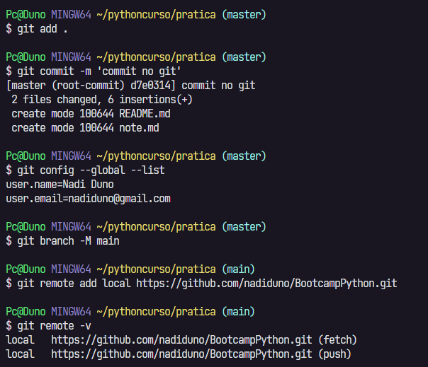

[](https://portfolio-nadi.vercel.app/)
[](https://twitter.com/nadiduno)
[](https://www.linkedin.com/in/nadiduno/)
<br />
<br />


# Comandos do bash
<br />
<div align="center">
  
  <br />
</div>
- ## Introdução ao CLI
	
	```pwd``` 
- mostra onde **eu** estou no computador.

	```touch```
- cria um arquivo vazio.

	```cd```
- muda **eu** de diretório/pasta no computador.

	```mv```
- move para outro lugar/diretório uma pasta ou arquivo.
	
	```echo```
- comando para escrever algo no terminal (output/resultado) ou em um arquivo.

# Comandos Git
- ## Introdução ao Git

	```git config --global --list```
- ver em lista as configurações globais.
	
	```git config --global user.name "nome"```
- definir nome global (informação padrão em qualquer repositório no computador).
	
	```git config --global user.email "email@email.com"```
- definir email global (informação padrão em qualquer repositório no computador).

	```git init``` 
- inicia pela primeira vez o git em um projeto/pasta.

	```git branch -m nomeBranch```
- inicia pela primeira vez um branch no projeto.
	
	```git branch -v```
- permite visualizar os branchs de um projeto (somente locais).

	```git branch -a -v```
- permite visualizar os branchs de um projeto (no git e github).

	```git status```
- permite ver o que está acontecendo com os arquivos no git.

	```git add nomePasta nomeArquivo etc``` 
- adiciona os arquivos com o nome informado que foram modificados para serem rastreados pelo git. Pode ser um nome de arquivo ou mais, separados por espaço.

	```git add .```
- adiciona todos os arquivos da pasta que **eu** estou (veja pelo pwd).

	```git commit -m "mensagem commit"```
- criar o salvamento da minha versão localmente com uma mensagem de atualização.

	```git remote add origin https://github.com/MeuNomeGithub/Meurepositorio.git```
- adiciona o repositório online do Github com o nome de "origin" no meu git.

	```git remote -v```
- visualiza os repositórios remotos registrados no git.

	```git -h```
- exibe a ajuda geral do git. Posso utilizar outro comando para ter informações específicas daquele comando. Ex: git remote -h.

	```git log --oneline```
- exibe o histórico dos commits de forma resumida, ou seja, sem o usuário ou e-mail do desenvolvedor, somente código do commit e a mensagem do mesmo.

	```git push -u origin master```
- empurra o código local do Git para o repositório online (Github). O atributo "-u" garante que o branch, por exemplo "master", seja criado no repositório se não houver o mesmo.
<br />
<div align="center">
  
  <br />
</div>

Professora [Marta Cabel](https://github.com/Ravenbells) <br />
[Link da Aula](https://github.com/Ravenbells/gitAulaComandos/edit/master/README.md) <br />
[Toti](https://totidiversidade.com.br/) - novembro/2022
